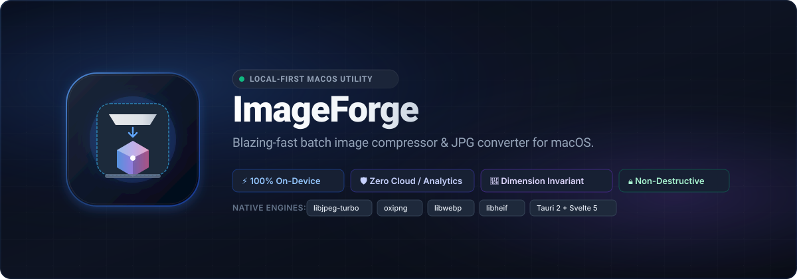

<div align="center">



<br />

# ImageForge

**A blazing-fast, local-first macOS utility for batch image compression and JPG conversion.**  
*No cloud uploads · No subscriptions · 100% offline & private*

<br />

[](https://github.com/devenes/imageforge/actions/workflows/ci.yml)
[](https://github.com/devenes/imageforge/releases)
[-black.svg?logo=apple&logoColor=white)](https://github.com/devenes/imageforge)
[](https://opensource.org/licenses/MIT)
[](https://tauri.app/)
[](https://svelte.dev/)
[](https://www.rust-lang.org/)

</div>

---

ImageForge processes images entirely on-device using native codec libraries for maximum quality and speed. It supports JPEG, PNG, WebP, and HEIC/HEIF inputs, with lossless PNG optimization and three quality presets across all lossy formats.

---

## Features

- **Drag & drop** or file-picker batch import
- **Bulk compression** — process dozens of images in parallel
- **Three quality presets**: Best Quality · Balanced · Smallest
- **Format-preserving compression** — keeps your original format (PNG stays PNG, JPEG stays JPEG)
- **Convert to JPG** — any format converted to JPEG; transparent pixels composited over white `#FFFFFF`
- **Dimension invariant** — never changes pixel dimensions, guaranteed
- **Non-destructive** — originals are never overwritten; outputs get a `-compressed` suffix with automatic collision avoidance (`-compressed-1`, `-compressed-2`, …)
- **`NO_SAVINGS` detection** — if the candidate output is not smaller than the original, the original bytes are preserved and the result is marked accordingly; you still get an output file
- **EXIF & ICC color profile preservation** (JPEG, WebP)
- **HEIC/HEIF support** natively via libheif
- **Atomic writes** — every output is written to a temp file then renamed, so partial writes never corrupt your disk
- **macOS-native UI** — overlay titlebar, system dark/light mode, native traffic lights

---

## Requirements

### Runtime
- macOS 11 Big Sur or later (Apple Silicon and Intel)

### Development
| Tool | Version |
|---|---|
| Rust | 1.98.1 (pinned via `rust-toolchain.toml`) |
| Node.js | ≥ 20 |
| pnpm | ≥ 9 |
| Xcode Command Line Tools | latest |
| Homebrew | latest |

---

## Quick Start

### 1. Install system dependencies

```sh
brew install jpeg-turbo webp libheif cmake nasm pkgconf
```

### 2. Clone and install

```sh
git clone https://github.com/devenes/imageforge.git
cd imageforge
pnpm install
```

### 3. Run in development mode

```sh
export PKG_CONFIG_PATH="/opt/homebrew/lib/pkgconfig:$PKG_CONFIG_PATH"
pnpm tauri dev
```

### 4. Run tests

```sh
export PKG_CONFIG_PATH="/opt/homebrew/lib/pkgconfig:$PKG_CONFIG_PATH"
cargo test --manifest-path src-tauri/Cargo.toml
```

---

## Building a Release

```sh
export PKG_CONFIG_PATH="/opt/homebrew/lib/pkgconfig:$PKG_CONFIG_PATH"
pnpm tauri build
```

This produces:
- `src-tauri/target/release/bundle/macos/ImageForge.app`
- `src-tauri/target/release/bundle/dmg/ImageForge_0.1.0_aarch64.dmg`

> **Note:** The distributed `.app` bundle must include `libheif.dylib` and its transitive dependencies in `Contents/Frameworks/` for zero-dependency operation. See `scripts/bundle_mac.sh` for the dylib bundling helper.

---

## Architecture

```
imageforge/
├── src/                        # Svelte 5 frontend
│   ├── App.svelte              # Root component, keyboard shortcuts
│   ├── app.css                 # System dark/light theme variables
│   └── lib/
│       ├── components/         # UI components
│       │   ├── DropZone.svelte
│       │   ├── FileQueue.svelte
│       │   ├── FileRow.svelte
│       │   ├── CompressionControls.svelte
│       │   ├── ProgressView.svelte
│       │   ├── ResultsSummary.svelte
│       │   └── PreferencesModal.svelte
│       ├── stores/
│       │   └── appState.svelte.ts   # Svelte 5 runes state
│       └── config/
│           └── appConfig.ts
│
└── src-tauri/                  # Rust backend
    └── src/
        ├── models.rs           # IPC types (ImageInfo, CompressionResult, …)
        ├── errors/mod.rs       # AppError with user-friendly messages
        ├── metadata.rs         # Magic-byte format detection, EXIF/ICC
        ├── validation.rs       # verify_dimensions invariant + calculate_savings
        ├── output.rs           # Collision-safe paths + atomic_write_file
        ├── processor.rs        # Per-file compression lifecycle
        ├── queue.rs            # Bounded async worker pool + CancellationToken
        ├── commands.rs         # Tauri IPC command handlers
        └── formats/
            ├── jpeg.rs         # libjpeg-turbo encode/decode
            ├── png.rs          # oxipng lossless optimization
            ├── webp.rs         # libwebp encode/decode
            ├── heic.rs         # libheif-rs encode/decode
            └── convert.rs      # Any-format → JPG conversion
```

### Compression pipeline

```
inspect_files (IPC)
  └─ metadata::inspect_image   →  ImageInfo { width, height, format, bytes, … }

start_batch (IPC)
  └─ QueueManager::start_batch
       └─ per file (parallel, up to cpu_count.clamp(1, 6) workers):
            processor::process_file
              ├─ FixedQualityStrategy::process  →  formats/{jpeg,png,webp,heic,convert}.rs
              ├─ calculate_savings               →  NO_SAVINGS if candidate ≥ original
              ├─ resolve_output_path             →  collision-safe filename
              └─ atomic_write_file               →  tmp → rename
            emit progress_update event  →  frontend
```

### Quality presets

| Preset | JPEG quality | PNG oxipng level | WebP quality | HEIC quality |
|---|---|---|---|---|
| Best Quality | 92 | 2 | 92 | 88 |
| Balanced | 84 | 4 | 82 | 78 |
| Smallest | 74 | 6 | 70 | 65 |

---

## Keyboard Shortcuts

| Shortcut | Action |
|---|---|
| `⌘ O` | Open file picker |
| `⌘ K` | Clear queue |
| `⌘ ↵` | Start compression |
| `⌘ ,` | Open Preferences |
| `Esc` | Cancel batch in progress |

---

## Tech Stack

| Layer | Technology |
|---|---|
| Shell | Tauri 2.x |
| Frontend | Svelte 5, TypeScript, Vite 8 |
| Backend | Rust 1.98 (Tokio async runtime) |
| JPEG | libjpeg-turbo 3.2 (turbojpeg crate) |
| PNG | oxipng 10.2 (pure Rust) |
| WebP | libwebp 1.6 (webp + img-parts crates) |
| HEIC/HEIF | libheif 1.23 (libheif-rs 3.0 crate) |
| Concurrency | tokio + tokio-util CancellationToken |
| IDs | uuid v4 |
| Logging | tracing + tracing-subscriber |

---

## Testing

**14 tests total** — all pass, zero warnings.

```sh
export PKG_CONFIG_PATH="/opt/homebrew/lib/pkgconfig:$PKG_CONFIG_PATH"
cargo test --manifest-path src-tauri/Cargo.toml
```

| Suite | Tests |
|---|---|
| Unit (`validation.rs`) | dimension invariant, savings calculation |
| Unit (`output.rs`) | collision resolution, atomic write |
| Integration | JPEG/PNG/WebP/HEIC round-trips, RGBA→JPG white-background compositing, `NO_SAVINGS` path, triple-collision avoidance |

---

## License

MIT — see [`LICENSE`](LICENSE) for full text.

Third-party notices for libjpeg-turbo, libwebp, libheif, and oxipng are in [`THIRD_PARTY_NOTICES.md`](THIRD_PARTY_NOTICES.md).

---

## Author

Crafted with care by [Enes Turan](https://github.com/devenes).

