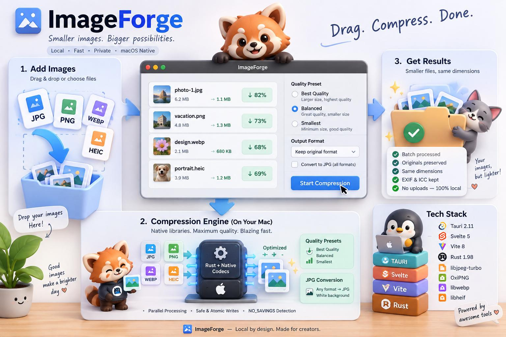

<div align="center">



<br />

# ImageForge

**A blazing-fast, local-first macOS utility for batch image compression and JPG conversion.**
*No cloud uploads · No subscriptions · 100% offline & private*

<br />

[](https://github.com/devenes/imageforge/actions/workflows/ci.yml)
[](https://github.com/devenes/imageforge/releases)
[-black.svg?logo=apple&logoColor=white)](https://github.com/devenes/imageforge)
[](https://opensource.org/licenses/MIT)
[](https://tauri.app/)
[](https://svelte.dev/)
[](https://www.rust-lang.org/)

</div>

---

ImageForge processes images entirely on-device using native codec libraries for maximum quality and speed. It supports JPEG, PNG, WebP, and HEIC/HEIF inputs, with lossless PNG optimization and three quality presets across all lossy formats.

---

## Features

- **Drag & drop** or file-picker batch import
- **Bulk compression** — process dozens of images in parallel
- **Three quality presets**: Best Quality · Balanced · Smallest
- **Format-preserving compression** — keeps your original format (PNG stays PNG, JPEG stays JPEG)
- **Convert to JPG** — any format converted to JPEG; transparent pixels composited over white `#FFFFFF`
- **Dimension invariant** — never changes pixel dimensions, guaranteed
- **Non-destructive** — originals are never overwritten; outputs get a `-compressed` suffix with automatic collision avoidance (`-compressed-1`, `-compressed-2`, …)
- **`NO_SAVINGS` detection** — if the candidate output is not smaller than the original, the original bytes are preserved and the result is marked accordingly; you still get an output file
- **EXIF & ICC color profile preservation** (JPEG, WebP)
- **HEIC/HEIF support** natively via libheif
- **Atomic writes** — every output is written to a temp file then renamed, so partial writes never corrupt your disk
- **macOS-native UI** — overlay titlebar, system dark/light mode, native traffic lights

---

## Requirements

### Runtime
- macOS 11 Big Sur or later (Apple Silicon and Intel)

### Development
| Tool | Version |
|---|---|
| Rust | 1.98.1 (pinned via `rust-toolchain.toml`) |
| Node.js | ≥ 20 |
| pnpm | ≥ 9 |
| Xcode Command Line Tools | latest |
| Homebrew | latest |

---

## Quick Start

### 1. Install system dependencies

```sh
brew install jpeg-turbo webp libheif cmake nasm pkgconf
```

### 2. Clone and install

```sh
git clone https://github.com/devenes/imageforge.git
cd imageforge
pnpm install
```

### 3. Run in development mode

```sh
export PKG_CONFIG_PATH="$(brew --prefix)/lib/pkgconfig:${PKG_CONFIG_PATH:-}"
pnpm tauri dev
```

### 4. Run tests

```sh
export PKG_CONFIG_PATH="$(brew --prefix)/lib/pkgconfig:${PKG_CONFIG_PATH:-}"
cargo test --manifest-path src-tauri/Cargo.toml
```

---

## Local macOS Build & Packaging

ImageForge currently ships as an **unsigned Apple Silicon application**.

No Apple Developer account, certificate, API key, or notarization is required to build and use the application locally.

The release build is currently:
- macOS only
- Apple Silicon only (`aarch64-apple-darwin`)
- unsigned
- not notarized
- self-contained (all required native dynamic libraries are bundled into the application)

### Run the Release Pipeline

Run the master release pipeline script:

```sh
./scripts/build_release.sh
```

*(Optional: use `./scripts/build_release.sh --install-deps` to automatically install any missing Homebrew dependencies).*

The pipeline automatically validates the ARM64 environment, runs backend and frontend test suites, builds the Tauri binary, bundles native dynamic libraries (`Contents/Frameworks/`), rewrites dynamic library paths, and packages a drag-to-Applications DMG.

### Build Outputs

A successful build produces:

- **Application Bundle:**
  ```text
  src-tauri/target/aarch64-apple-darwin/release/bundle/macos/ImageForge.app
  ```
- **Installer DMG:**
  ```text
  dist/ImageForge_<version>_aarch64.dmg
  ```

### First-Launch Behavior (Gatekeeper)

Because the application is unsigned, macOS may display a security warning the first time it is opened:

> *"ImageForge cannot be opened because Apple cannot check it for malicious software"* or *"unidentified developer"*.

To open the application:
1. In Finder, locate `ImageForge.app` (or open it from `/Applications`).
2. **Right-click (or Control-click)** the app icon and select **Open**.
3. In the dialog that appears, click **Open**.
4. Alternatively, go to **System Settings → Privacy & Security**, scroll down to the Security section, and click **Open Anyway**.

Subsequent launches will open normally without warnings.

---

## Pre-built Releases & GitHub Artifacts

Users do not need to install developer tools or build the project from source:

1. **GitHub Releases:**
   Every git tag (e.g. `v0.1.0`) automatically triggers the Release workflow on an Apple Silicon runner, publishing the ready-to-use `ImageForge_<version>_aarch64.dmg` under [Releases](https://github.com/devenes/imageforge/releases).
2. **GitHub Actions Artifacts:**
   You can also manually trigger the **Release** workflow in the Actions tab (`workflow_dispatch`) to generate and download the `ImageForge-aarch64-dmg` artifact directly from the run summary.

### Compression pipeline

```
inspect_files (IPC)
  └─ metadata::inspect_image   →  ImageInfo { width, height, format, bytes, … }

start_batch (IPC)
  └─ QueueManager::start_batch
       └─ per file (parallel, up to cpu_count.clamp(1, 6) workers):
            processor::process_file
              ├─ FixedQualityStrategy::process  →  formats/{jpeg,png,webp,heic,convert}.rs
              ├─ calculate_savings               →  NO_SAVINGS if candidate ≥ original
              ├─ resolve_output_path             →  collision-safe filename
              └─ atomic_write_file               →  tmp → rename
            emit progress_update event  →  frontend
```

### Quality presets

| Preset | JPEG quality | PNG oxipng level | WebP quality | HEIC quality |
|---|---|---|---|---|
| Best Quality | 92 | 2 | 92 | 88 |
| Balanced | 84 | 4 | 82 | 78 |
| Smallest | 74 | 6 | 70 | 65 |

---

## Keyboard Shortcuts

| Shortcut | Action |
|---|---|
| `⌘ O` | Open file picker |
| `⌘ K` | Clear queue |
| `⌘ ↵` | Start compression |
| `⌘ ,` | Open Preferences |
| `Esc` | Cancel batch in progress |

---

## Tech Stack

| Layer | Technology |
|---|---|
| Shell | Tauri 2.x |
| Frontend | Svelte 5, TypeScript, Vite 8 |
| Backend | Rust 1.98 (Tokio async runtime) |
| JPEG | libjpeg-turbo 3.2 (turbojpeg crate) |
| PNG | oxipng 10.2 (pure Rust) |
| WebP | libwebp 1.6 (webp + img-parts crates) |
| HEIC/HEIF | libheif 1.23 (libheif-rs 3.0 crate) |
| Concurrency | tokio + tokio-util CancellationToken |
| IDs | uuid v4 |
| Logging | tracing + tracing-subscriber |

---

## Testing

**14 tests total** — all pass, zero warnings.

```sh
export PKG_CONFIG_PATH="/opt/homebrew/lib/pkgconfig:$PKG_CONFIG_PATH"
cargo test --manifest-path src-tauri/Cargo.toml
```

| Suite | Tests |
|---|---|
| Unit (`validation.rs`) | dimension invariant, savings calculation |
| Unit (`output.rs`) | collision resolution, atomic write |
| Integration | JPEG/PNG/WebP/HEIC round-trips, RGBA→JPG white-background compositing, `NO_SAVINGS` path, triple-collision avoidance |

---

## License

MIT — see [`LICENSE`](LICENSE) for full text.

Third-party notices for libjpeg-turbo, libwebp, libheif, and oxipng are in [`THIRD_PARTY_NOTICES.md`](THIRD_PARTY_NOTICES.md).

---

## Author

Crafted with care by [Enes Turan](https://github.com/devenes).
